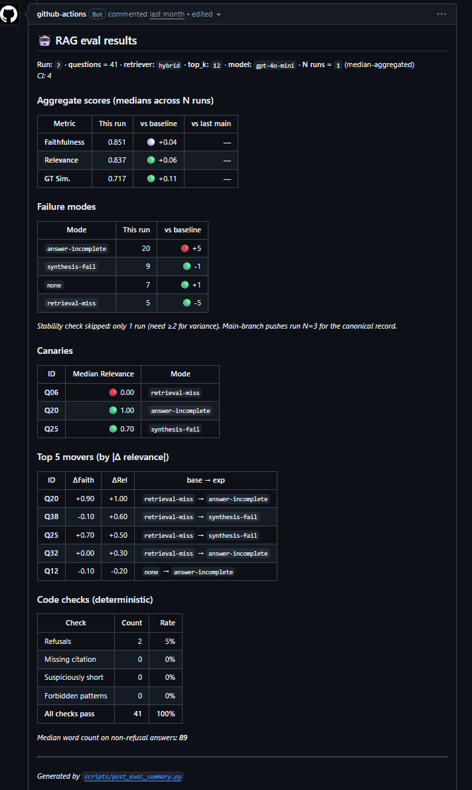

# rag-eval-lab

**A RAG system over the Kubernetes documentation, with a CI quality gate that runs on every commit.**

[**Live demo →**](https://rag-eval-lab.fly.dev) · [API explorer →](https://rag-eval-lab.fly.dev/docs)

---

## What this is

A production-shaped retrieval-augmented generation system built with a QA engineer's mindset: the question isn't just "does it answer correctly?" but "can I *prove* it answers correctly, and will I know the moment it stops?"

Every push to `main` runs 41 scored questions through the full RAG pipeline — retrieval, generation, LLM-as-judge evaluation — and fails the build if quality drops below threshold.

---

## Results

| Metric | Baseline (dense, k=5) | Current (hybrid, k=12) | Δ |
|---|---:|---:|---:|
| Faithfulness | 0.815 | **0.859** | +0.04 |
| Answer Relevance | 0.778 | **0.846** | +0.07 |
| GT Similarity | 0.610 | **0.700** | +0.09 |
| Retrieval-miss | 10 / 41 | **3 / 41** | −70% |




Retrieval configuration reached through a full ablation study: **dense → hybrid (BM25 + vector + RRF) → cross-encoder reranking**. Reranking was tested (MiniLM-L-6 and BGE-large) and rejected — plain hybrid won on this corpus. See [`evals/experiments.md`](evals/experiments.md) for the full decision log.

---

## Architecture

```
Question
   │
   ▼
┌─────────────────────────────────┐
│  Hybrid Retriever               │
│  BM25 + text-embedding-3-small  │
│  RRF fusion · top_k=12          │
│  3,770 chunks · K8s docs        │
└────────────────┬────────────────┘
                 │ top-k chunks
                 ▼
┌─────────────────────────────────┐
│  Generator                      │
│  gpt-4o-mini · temp=0.0         │
│  strict grounding prompt        │
│  [n]-style citations enforced   │
└────────────────┬────────────────┘
                 │ answer + contexts
                 ▼
              Response
```

**Eval pipeline (runs in CI on every push):**

```
run_eval.py → score_eval.py (gpt-4o judge) → code_checks.py → test_eval_gate.py
     ↓              ↓                              ↓                  ↓
 41 answers    faithfulness /            citation presence /     pytest asserts
              relevance / GT-sim         length / refusals      12+ thresholds
```

---

## CI quality gate

The gate runs via GitHub Actions and posts results as a PR comment.

**On pull requests (N=1):** fast feedback, ~5 min, gates merge.  
**On main push (N=3):** rigorous run, per-question medians across 3 runs, stability classification.

**What gets checked (14 pytest assertions):**

| Category | Check |
|---|---|
| Aggregate | Faithfulness ≥ 0.83, Relevance ≥ 0.80, GT-sim ≥ 0.65 |
| Failure modes | retrieval-miss ≤ 9, clean answers ≥ 5 |
| Canaries | Q20 and Q25 relevance above minimum (questions that scored 0.00 in baseline) |
| Stability | Bimodal questions ≤ 10 (N=3 only) |
| Regression | No metric drops >0.05 from last main |
| Drift | No failure-mode count shifts beyond configured deltas |
| Code checks | Missing citations ≤ 5, short answers ≤ 3, forbidden patterns = 0 |

**What a passing PR looks like:**

```
✓ test_aggregate_above_threshold[faithfulness]
✓ test_aggregate_above_threshold[answer_relevance]
✓ test_aggregate_above_threshold[ground_truth_similarity]
✓ test_retrieval_miss_count_below_ceiling
✓ test_clean_answer_count_above_floor
✓ test_bimodal_question_count
✓ test_canary_question[Q06]
✓ test_canary_question[Q20]
✓ test_canary_question[Q25]
✓ test_no_regression_vs_last_main
✓ test_no_failure_mode_drift_vs_last_main
✓ test_code_check_threshold[missing_citation]
✓ test_code_check_threshold[suspiciously_short]
✓ test_code_check_threshold[forbidden_patterns]
```

---

## Key engineering decisions

**Why hybrid retrieval won over reranking:** BM25 + vector with RRF fusion reduced retrieval-miss from 10 to 3 without the latency cost or domain-mismatch risk of cross-encoder reranking. Both MiniLM-L-6 and BGE-large were benchmarked; neither beat plain hybrid on this corpus. Full results in [`evals/experiments.md`](evals/experiments.md).

**Why N=3 medians instead of a single eval run:** A single LLM-as-judge run has ±0.05–0.10 per-question variance. Observed range of "none" (clean answers) across identical runs: {4, 6, 7, 8, 10, 11}. Taking medians across 3 runs stabilises aggregate scores and surfaces *which* questions are bimodal — a diagnostic signal for borderline cases.

**Why the judge rubric matters:** We briefly tried a stricter decision-tree judge rubric. Faithfulness dropped from 0.88 to 0.70 on identical model output — the rubric working as designed, but making scores incomparable to prior runs. Reverted to the original prose-band rubric and mitigated variance via N=3 instead. Documented in `thresholds.json._meta.judge_history`.

**Why thresholds have notes:** Every threshold in `evals/thresholds.json` has a `note` field explaining *why* the value was chosen, what the observed range was, and when it was last updated. A quality gate without documented reasoning degrades into theater over time.

---

## Local setup

```bash
git clone https://github.com/Larsenvini/rag-eval-lab
cd rag-eval-lab
python -m venv .venv && source .venv/bin/activate   # Windows: .venv\Scripts\activate
pip install -r requirements.txt

# Set your OpenAI key
export OPENAI_API_KEY=sk-...    # Windows: $env:OPENAI_API_KEY = "sk-..."

# Download and embed the corpus (~3,770 chunks, costs ~$0.05)
python -m scripts.download_corpus
python -m scripts.ingest

# Start the API
uvicorn src.api:app --reload
# → http://localhost:8000        (chat UI)
# → http://localhost:8000/docs   (API explorer)
```

**Run the test suite:**

```bash
pytest tests/ -q
# 70+ tests, ~90s, no API calls required
```

**Run the eval gate manually:**

```bash
python -m scripts.run_eval_n --n 3 --note "local run"
# Scores 41 questions across 3 runs (~$1.50, ~15 min)
# Then:
EVAL_GATE_FILE=evals/results/scored_n_<timestamp>.json pytest tests/test_eval_gate.py -v
```

**Ask a question via CLI:**

```bash
python -m src.ask "How does a Pod differ from a container?"
python -m src.ask --retriever hybrid "When should I use a StatefulSet?"
```

---

## Smoke tests (live monitoring)

The deployed instance is monitored by a daily smoke test suite:

```bash
RUN_SMOKE=1 pytest tests/test_smoke_live.py -v
# Hits /healthz, /ask, /docs, and the UI against the live URL
# Opt-in so it never runs in normal pytest sweeps
```

Runs automatically every day at 12:00 UTC via `.github/workflows/smoke.yml`. GitHub sends an email if any check fails.

---

## Project layout

```
src/
├── api.py                  FastAPI service (/healthz, /ask, /)
├── config.py               Typed config, env-var overrides
├── hybrid_retriever.py     BM25 + vector + RRF fusion
├── retriever.py            Dense-only retriever (baseline)
├── reranker.py             Cross-encoder reranker (E3/E3b, rejected)
├── generator.py            gpt-4o-mini with strict grounding
├── chunker.py              Heading-aware markdown splitter
├── store.py                ChromaDB wrapper
└── static/index.html       Chat UI

scripts/
├── download_corpus.py      Clone + filter K8s docs
├── ingest.py               Chunk + embed + store
├── run_eval.py             Single eval run
├── run_eval_n.py           N-run orchestrator → merge_scored_runs
├── merge_scored_runs.py    Median / stability math (pure functions)
├── score_eval.py           LLM-as-judge scoring
├── code_checks.py          Deterministic citation / length checks
├── compare_runs.py         Diff two scored runs vs baseline
└── post_eval_summary.py    Markdown formatter for PR comments

evals/
├── golden_set.json         41 questions (11 manual + 30 synthetic)
├── thresholds.json         Quality gate thresholds with rationale
├── experiments.md          Lab notebook: every decision, with data
└── results/
    ├── baseline.json       Locked Week-2 reference (dense, k=5)
    └── last_main.json      Latest main-branch run (regression anchor)

tests/
├── test_eval_gate.py       14-assertion quality gate
├── test_merge_scored_runs.py  Unit tests for median/stability math
├── test_code_checks.py     Deterministic check tests
├── test_hybrid_retriever.py   Retriever unit + composition tests
├── test_reranker.py        Reranker tests (mocked, no model download)
├── test_api.py             FastAPI route tests
├── test_chunker.py         Chunker tests
└── test_smoke_live.py      Live-URL smoke tests (opt-in)
```

---

## Stack

Python 3.11 · FastAPI · ChromaDB · OpenAI (text-embedding-3-small, gpt-4o-mini, gpt-4o) · rank-bm25 · sentence-transformers · pytest · GitHub Actions · Docker · Fly.io

---

## About

Built by [Vinicius Larsen](https://vinicius-larsen.com) · [GitHub](https://github.com/Larsenvini) · [LinkedIn](https://linkedin.com/in/vinilarsen)

The motivation: most LLM applications are deployed as black boxes, evaluated informally, and left to drift. This project applies the same discipline I use in QA automation — locked baselines, regression gates, documented thresholds — to an LLM system. The engineering isn't novel; the application of it to eval is.
